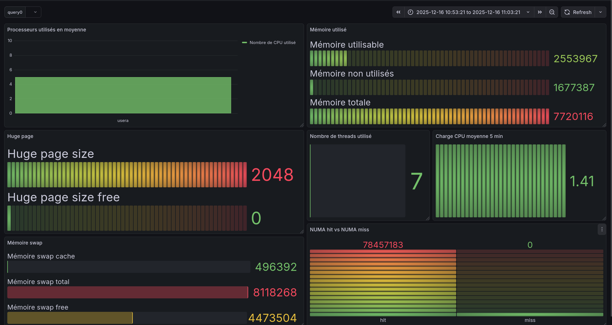

# Proof of concept : LDMS
This project is a fork of : https://github.com/giovtorres/slurm-docker-cluster.

It uses LDMS : https://ovis-hpc.readthedocs.io/projects/ldms/en/latest/index.html

The goal was to create a basic cluster, and install LDMS made to gather metrics in a HPC environment.

Made during my intership at CEA.



## Quickstart

```sh
docker build -t slurm-docker-cluster --network=host .
docker build -t logstash-with-opensearch-plugins --network=host logstash #building logstash
docker compose up -d
```


Depending on your goal:

  * **To see how to use this project** (manual usage), refer to the **[example-list below](#example-)**.
  * **For automatic launches and Grafana visualization**, see the detailed workflow **[here](./md/final_workflow.md)**.


## Arborescence explanation

```
.
├── docker-compose.yml
├── docker-entrypoint.sh
├── Dockerfile
├── ldms_conf
├── logstash
├── md
├── README.md
├── scripts
├── shared
└── slurm
```

- `Dockerfile`, `docker-compose.yml`, `docker-entrypoint.sh` the main images is `slurm-docker-cluster`, it builds openmpi, slurm, pmix, ldms and so on.
- `ldms_conf` -> all the config file related to the ldms daemon, whether it be sampler or aggregator config are here
- `logstash` -> logstash config file to get data from the Kafka broker (the LDMS aggregator can send data to the broker if `ldms_conf/agg_kafka.conf` is used, see [here](./md/ldms_kafka.md))
- `md` -> all the file located below in the Example section are written here
- `scripts` -> shell script to create user [scripts explanation](./scripts/README.md)
- `shared` -> a shared folder for all the node. The compute folders is only mounted on the `compute` node, .ie `c1`, `c2`, `c3`. The folder `data` is mounted as is in the `slurmctld` service.

The mount is made using the docker compose `volume` method.

> All the subfolders contains README.md

## Docker

### Slurm-docker-cluster

This is the main image used for this project. It uses the multi-stage build feature from docker.

An anchor is used for the compute node, even though the number of compute node is 3 for this whole project and config files were written to follow this logic. 

### How to build 

```sh
# pwd : ldms-docker-cluster
docker build -t slurm-docker-cluster --network=host .
docker build -t logstash-with-opensearch-plugins --network=host logstash 
```


## Example :

- LDMS manual launch that gathers metrics and store them in `.csv` : [🔗](./md/ldms_csv.md)
- LDMS manual launch that gathers metrics and launch them in Kafka : [🔗](./md/ldms_kafka.md)
- LDMS automatic sampler launch when job is is started with Prolog/Epilog: [🔗](./md/ldms_prolog.md)
- LDMS automatic launch with grafana visualisation : [🔗](./md/final_workflow.md)